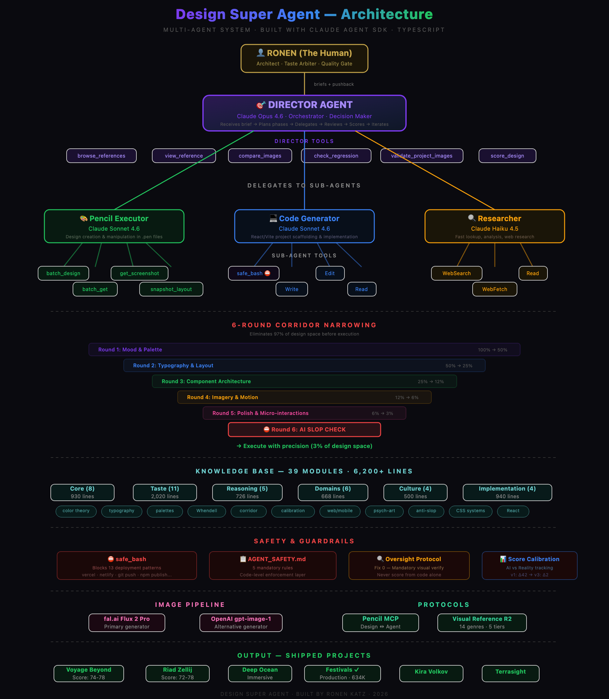
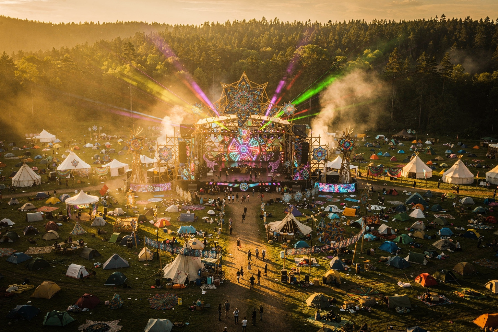

<div align="center">

# Design Super Agent

### A multi-agent AI system that designs professional websites autonomously

[](https://docs.anthropic.com/en/docs/agents-and-tools/claude-agent-sdk)
[](https://anthropic.com)
[](https://modelcontextprotocol.io)
[](https://www.typescriptlang.org)
[](https://aibreakthroughawards.com)

<br />



*Full system architecture — from human taste arbiter to shipped projects*

</div>

---

## What It Does

You give it a design brief. It gives you a professional website.

A **Director agent** (Claude Opus 4.6) reads the brief, eliminates 97% of the design space through a 6-round corridor-narrowing methodology, then orchestrates **3 specialized sub-agents** to build, test, and refine the result — all without human intervention.

```
Brief → Director → Corridor Narrowing → Sub-Agents → Built Website
        (Opus)     (6 rounds)           (3 agents)    (HTML/CSS/JS + images)
```

---

## Architecture

```
┌─────────────────────────────────────────────────────────────┐
│                    HUMAN (Taste Arbiter)                     │
│              Sets brief, reviews final output                │
└─────────────────────┬───────────────────────────────────────┘
                      │
┌─────────────────────▼───────────────────────────────────────┐
│              DIRECTOR AGENT (Claude Opus 4.6)               │
│                                                             │
│  Tools: compare_images, check_regression, browse_references │
│         validate_project_images, get_screenshot             │
│                                                             │
│  ┌─────────────────────────────────────────────────────┐    │
│  │          6-Round Corridor Narrowing                  │    │
│  │  R1: Genre Lock     R4: Component Spec              │    │
│  │  R2: Palette+Type   R5: Imagery Mandate             │    │
│  │  R3: Layout Grid    R6: AI Slop Check               │    │
│  └─────────────────────────────────────────────────────┘    │
└──────┬──────────────────┬──────────────────┬────────────────┘
       │                  │                  │
┌──────▼──────┐   ┌──────▼──────┐   ┌──────▼──────┐
│   Pencil    │   │    Code     │   │  Researcher │
│  Executor   │   │  Generator  │   │             │
│  (Sonnet)   │   │  (Sonnet)   │   │  (Haiku)    │
│             │   │             │   │             │
│ 14 Pencil   │   │ Read/Write  │   │ WebFetch    │
│ MCP tools   │   │ safe_bash   │   │ WebSearch   │
│             │   │ image gen   │   │ Read        │
└─────────────┘   └─────────────┘   └─────────────┘
```

| Component | Model | Role |
|-----------|-------|------|
| **Director** | Claude Opus 4.6 | Orchestration, corridor narrowing, quality review, regression detection |
| **Pencil Executor** | Claude Sonnet | Visual design in `.pen` files via 14 MCP tools |
| **Code Generator** | Claude Sonnet | Full-stack web builds (Vite/React/Next.js), AI image generation |
| **Researcher** | Claude Haiku | Visual references, cultural context, design inspiration |

---

## Key Numbers

| Metric | Value |
|--------|-------|
| Knowledge base modules | **40** across 7 categories |
| Knowledge base size | **6,368 lines** of design expertise |
| Corridor narrowing | Eliminates **97%** of design space before execution |
| Score calibration gap closed | **42 points** (AI self-assessment vs reality) |
| Safety guardrails | **13 deployment patterns** blocked at code level |
| Shipped projects | **9** complete websites |

---

## Example Output

Websites designed and built entirely by the agent — from brief to production code with AI-generated imagery:

<div align="center">
<table>
<tr>
<td align="center"><br /><b>Psychedelic Universe Festivals</b><br /><sub>7 background zones, animated counters</sub></td>
<td align="center"><br /><b>Deep Ocean Explorer</b><br /><sub>Abyssal gradient, underwater atmosphere</sub></td>
<td align="center"><br /><b>Voyage Beyond</b><br /><sub>Planetary hero, cosmic scale</sub></td>
</tr>
</table>
</div>

---

## Knowledge Base

The agent's design expertise is structured into **7 categories**, loaded dynamically based on project domain:

```
src/knowledge/
├── core/           ← Color theory, typography, composition, gestalt,
│                     visual hierarchy, accessibility, motion, interaction
├── taste/          ← Artistic references, taste calibration, advanced techniques,
│                     visual languages, genre deep-dives, exemplary sites
├── reasoning/      ← Corridor narrowing, score calibration, review methodology,
│                     iteration awareness, rule-breaking, vision interpretation
├── domains/        ← Web, mobile, branding, design systems,
│                     data visualization, user research
├── culture/        ← Psychedelic art history, design history,
│                     cross-cultural design
├── implementation/ ← CSS patterns, responsive strategies,
│                     performance optimization, animation techniques
└── anti-patterns/  ← Common failures, AI slop detection,
                      intentional design recipes as antidotes
```

---

## Safety & Guardrails

This system was designed after a live incident where an agent deployed to production without permission.

| Layer | Mechanism | What It Does |
|-------|-----------|-------------|
| **Code-level** | `safe_bash` tool | Blocks 13 deployment patterns (vercel, git push, npm publish, etc.) at the tool level — cannot be overridden by prompts |
| **Validation** | `validate_project_images` | Director calls post-build to verify actual images match the visual asset plan |
| **Regression** | `check_regression` | Detects visual regressions between iterations with severity ratings |
| **Calibration** | Score calibration log | Tracks historical overestimates (avg: 10 points) to prevent score inflation |
| **Prompt-level** | Stakes framing | System prompt includes consequences for dishonest scoring |
| **Documentation** | `AGENT_SAFETY.md` | Full incident report and enforcement levels |

---

## How the Corridor Narrowing Works

Instead of generating a design from an infinite possibility space, the Director systematically eliminates options through 6 rounds before any sub-agent writes a line of code:

```
Round 1: Genre Lock        "This is Neo-Brutalist, not Glassmorphism"
Round 2: Palette + Type    "Monochrome + JetBrains Mono, not gradients + Inter"
Round 3: Layout Grid       "Asymmetric 2-col, not centered hero stack"
Round 4: Component Spec    "Cards with hard shadows, no border-radius"
Round 5: Imagery Mandate   "AI-generated hero + 3 section backgrounds, minimum"
Round 6: AI Slop Check     "Does this look like every other AI-generated site? Fix it."
```

By Round 6, the remaining design space is **~3%** of what it started with. Only then does the Code Generator begin building.

---

## Getting Started

### Prerequisites

- Node.js 18+
- [Pencil](https://pencil.ai) desktop app (for `.pen` file design)
- API keys: `ANTHROPIC_API_KEY`, and optionally `FAL_KEY` or `OPENAI_API_KEY` for image generation

### Installation

```bash
git clone https://github.com/roneni/design-super-agent.git
cd design-super-agent
npm install
cp .env.example .env  # Add your API keys
```

### Run

```bash
npm start -- --brief "Design a landing page for a meditation app" --domain wellness
```

### Configuration

Create a `project-config.json`:

```json
{
  "domain": "wellness",
  "pencilBinary": "/path/to/pencil-mcp-server",
  "references": [
    { "url": "https://example.com", "description": "Visual reference" }
  ]
}
```

---

## Project Structure

```
design-super-agent/
├── src/
│   ├── agent.ts              ← Main agent runner
│   ├── agents/definitions.ts ← Sub-agent configs (models, tools, prompts)
│   ├── prompts/system.ts     ← Director system prompt + knowledge injection
│   ├── prompts/sub-agents.ts ← Sub-agent instruction prompts
│   ├── tools/custom.ts       ← safe_bash, validate_project_images, compare_images
│   ├── tools/image-generation.ts  ← fal.ai + OpenAI image providers
│   ├── tools/reference-library.ts ← R2-backed visual reference database
│   ├── knowledge/            ← 40 modules, 6,368 lines (see above)
│   └── schemas/              ← Zod schemas for verdict + project config
├── projects/                 ← 9 shipped website projects
├── scripts/                  ← Reference library population, screenshots
├── tests/                    ← Judgment calibration tests
├── AGENT_SAFETY.md           ← Safety incident report + enforcement levels
└── docs/images/              ← Architecture diagram + output samples
```

---

## Built By

**Ronen** — Founder of [Psychedelic Universe](https://youtube.com/@PsychedelicUniverse) (634K subscribers, 156M views)

Part of the **Psychedelic Universe EchoSystem**: YouTube Channel → [Main Site](https://psychedelic-universe.com) → [HarmonySet](https://harmonyset.com) → [Universe Diffusion](https://universe-diffusion.vercel.app) → Design Super Agent

---

<div align="center">

*Nominated for [AI Breakthrough Awards 2026](https://aibreakthroughawards.com) — Multi-Agent AI System of the Year*

</div>
</content>
</invoke>